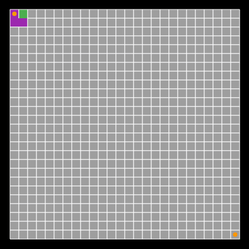

# Flutter Maze Generator

A Flutter application to generate and visualize mazes. This project provides a maze generator that creates mazes using the depth-first search algorithm and a maze drawer to render the generated maze.

After generating the maze, a path is found using the A* search algorithm, and the path is displayed on the screen by animating the path cells.



## Getting Started

### Prerequisites

Flutter: Make sure you have Flutter installed.

### Installing

1. Clone the repository:

```dart
git clone https://github.com/hamed-rezaee/flutter_maze_generator.git
```

2. Navigate to the project directory:

```dart
cd flutter-maze-generator
```

3. Run the app:

```dart
flutter run
```

## Usage

This Flutter app generates and displays a maze on the screen. The maze is generated using a depth-first search algorithm, and you can customize the maze's size by changing the `size` and `cellWidth` constants in the `main.dart` file.

```dart
const Size size = Size(300, 300);
const double cellWidth = 10;
```

The `size` constant defines the size of the maze canvas, and the `cellWidth` constant determines the width of each maze cell.

## Acknowledgments

This project is inspired by Coding Train's [Maze Generator](https://youtu.be/HyK_Q5rrcr4) by Daniel Shiffman.

## Contributing

Contributions are welcome! Please feel free to submit a Pull Request. If you find a bug or want to suggest a new feature, please open an issue.

## License

This project is licensed under the MIT License - see the [LICENSE](LICENSE) file for details.
